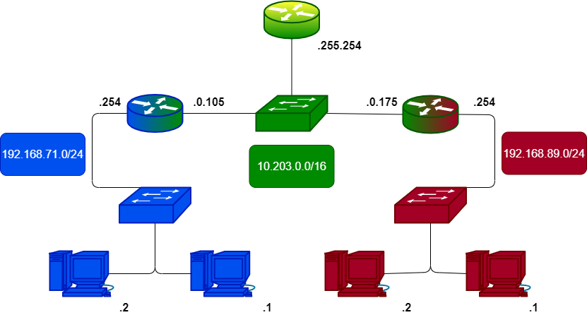

## Aksel PAULET
## Yohann ANSINELLI
### RT1 : B1

 

-------
 

## 
 **SAE 12**

## 
 *S’initier aux réseaux informatiques* 

## 
 <em> <u> Montage Binome </u></em> 

 

------
  

# Sommaire : 
 - ## Commande Mikrotik à connaître.
 - ## Montage Binome.

  

# Commande Mikrotik :

- ## ip address print :
    Affiche les adresses ip liées à chaque port ainsi que son mode de fonctionnement. D'usine le port 1 (WAN) est nommée eth1 et les 4ports restants ( LAN ) sont en bridge.
- ## ip route print : 
    Affiche toutes les routes connues sous forme d'un tableau ordonné.

- ## ip route add dst-address= { ip/masque } gayteway={ ip / port de sortie}
    Permets l'ajout d'une nouvelle route vers le réseau { dst-address } via { gateway }

- ## Procédure de rénitialisation d'usine :
  il vous faut débrancher tous les câbles Ethernet ainsi que l'alimentation brancher sur le routeur. Ensuite vous avez un petit endroit étroit pour insérer comme une aiguille avec un bouton au fond, maintenez l'et en même temps rebrancher l'alimentation attendait que le bouton USR clignote et retirer l'aiguille, votre routeur est maintenant réinitialisé.  
  Si malgré tout nous n'arrivons pas au réalisés, sur le site de Mikrotik l'on peut y trouver un logiciel permettant de le faire à partir de l'adresse MAC de ce dernier.

   

# Montage Binome :

- ## Schématisation du montage réseau :

 Si le schéma est mal visible, <a href="montage.drawio.png">clickez-ici</a>.
   

- ## Lors de cette SAE nous avons dû mettre en place une connexion entre deux réseaux. C'est dernier étant simplement séparés par un switch, deux solutions s'offrent à nous :
 

  - ## Utiliser le protocole RIP :
    - On active depuis la page web du routeur le protocole ( à faire sur les deux routeurs), RIP partageant sa table avec ses compères : nos deux réseaux seront amènent de communiquer directement

  - ## Mettre une route static :
    - Sur le routeur des deux réseaux à connecter ( ici le réseau bleu et rouge) l'on vient ajouter une route statique disant que si l'on vise une adresse dans le deuxième réseau alors je passe par cette adresse Ip ( adresse de la patte extérieure du deuxième routeur).  Commande permettant de faire cela :    

    
         
    
    ## Preuve de connectivité entre les réseaux :
     
    
         

    ## Configuration du routeur :
    -   Le routeur possède également un serveur DHCP nous facilitant la connectivité de nos ordinateurs une fois paramétrés selon les normes réseaux.
  
    
         

    ## Apperçu du montage d'un réseau :
    
         

    ### Si un autre routeur était entre nos deux réseaux il aurait également fallu le paramétrer pour qu'il puisse connaître les autres réseaux et ainsi de suite. dans un cas avec un grand nombre de saut a effectué l'on prévigilira les protocoles tels que RIP ou OSPF qui en plus de chercher les routes les plus rapides selon certains critères ( nombre de saut pour RIP et débit entre routeurs pour OSPF) possède la faculté d'échanger leur table de routage.

